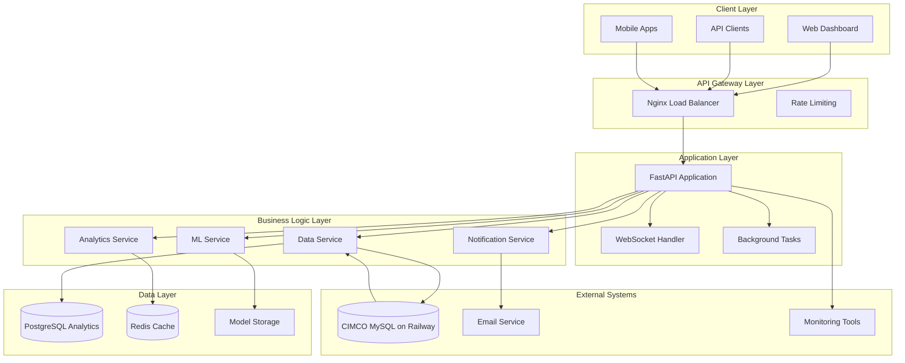

# Design Document

## Overview

The CIMCO ML Analytics application is designed as a microservices-based system built on FastAPI, providing machine learning capabilities for manufacturing data analysis. The system follows a layered architecture with clear separation between data ingestion, ML processing, API services, and presentation layers.

The application will handle time-series machine data, perform predictive analytics, and provide real-time insights through RESTful APIs and WebSocket connections. The design emphasizes scalability, maintainability, and high availability to support continuous manufacturing operations.

## Architecture

### High-Level Architecture



### Technology Stack

- **Web Framework**: FastAPI with Uvicorn ASGI server
- **Database**: MySQL (Railway) for source data, PostgreSQL for analytics data, Redis for caching
- **ML Framework**: Scikit-learn for traditional ML, TensorFlow/PyTorch for deep learning
- **Data Processing**: Pandas, NumPy for data manipulation
- **API Documentation**: OpenAPI/Swagger (built into FastAPI)
- **Containerization**: Docker with Docker Compose
- **Message Queue**: Celery with Redis broker for background tasks
- **Monitoring**: Prometheus + Grafana for metrics, structured logging

## Components and Interfaces

### 1. Data Ingestion Component

**Purpose**: Connect to and synchronize data from the CIMCO MySQL database on Railway.

**Key Classes**:
```python
class DataSyncService:
    async def sync_machine_data() -> SyncResult
    async def fetch_incremental_updates(last_sync: datetime) -> List[Record]
    async def validate_source_data(data: DataFrame) -> ValidationResult
    async def transform_cimco_data(raw_data: List[Dict]) -> List[MachineRecord]
    
class DatabaseConnector:
    async def connect_to_cimco_db() -> AsyncConnection
    async def execute_sync_query(query: str, params: Dict) -> QueryResult
    async def get_table_schema(table_name: str) -> TableSchema
    
class DataValidator:
    def validate_machine_record(record: MachineRecord) -> ValidationResult
    def validate_job_record(record: JobRecord) -> ValidationResult
    def check_data_integrity(records: List[Record]) -> IntegrityReport
```

**Database Configuration**:
```python
CIMCO_DATABASE_CONFIG = {
    "host": "gondola.proxy.rlwy.net",
    "port": 21632,
    "database": "railway", 
    "user": "root",
    "password": "DjYsEncznrHnsEKzAmDcHfJCvuoOoOuP",
    "mysql_port": 3306
}
```

**Interfaces**:
- REST endpoints: `POST /api/v1/data/sync`, `GET /api/v1/data/sync-status`
- Internal: MySQL connection pool, data transformation utilities
- Scheduled: Background sync tasks via Celery

### 2. Machine Learning Component

**Purpose**: Train, manage, and serve ML models for predictive analytics.

**Key Classes**:
```python
class MLModelManager:
    async def train_downtime_predictor() -> TrainingResult
    async def predict_maintenance_window(machine_id: str) -> PredictionResult
    async def detect_anomalies(machine_data: MachineData) -> AnomalyResult
    
class ModelTrainingPipeline:
    def preprocess_features(data: DataFrame) -> ProcessedData
    def train_model(data: ProcessedData, model_type: ModelType) -> TrainedModel
    def evaluate_model(model: TrainedModel, test_data: DataFrame) -> EvaluationMetrics
    
class PredictionService:
    async def predict_downtime(machine_id: str, horizon: int) -> DowntimePrediction
    async def calculate_failure_risk(machine_id: str) -> RiskAssessment
    async def optimize_schedule(jobs: List[Job]) -> OptimizedSchedule
```

**Interfaces**:
- REST endpoints: `POST /api/v1/ml/predict/*`, `POST /api/v1/ml/train`
- Internal: Model storage, feature engineering pipeline

### 3. Analytics Component

**Purpose**: Generate insights, reports, and real-time analytics.

**Key Classes**:
```python
class AnalyticsService:
    async def calculate_oee_metrics(machine_id: str, period: TimePeriod) -> OEEMetrics
    async def generate_efficiency_report(filters: ReportFilters) -> EfficiencyReport
    async def analyze_downtime_patterns() -> PatternAnalysis
    
class ReportGenerator:
    async def create_daily_report(date: datetime) -> DailyReport
    async def create_custom_report(config: ReportConfig) -> CustomReport
    def export_report(report: Report, format: ExportFormat) -> ExportedFile
    
class RealTimeMonitor:
    async def stream_machine_status() -> AsyncGenerator[MachineStatus]
    async def detect_critical_events(event: MachineEvent) -> AlertLevel
    async def update_live_metrics(metrics: LiveMetrics) -> None
```

**Interfaces**:
- REST endpoints: `GET /api/v1/analytics/*`, `GET /api/v1/reports/*`
- WebSocket: `/ws/machine-status`, `/ws/alerts`

### 4. Notification Component

**Purpose**: Handle alerts, notifications, and communication.

**Key Classes**:
```python
class NotificationService:
    async def send_maintenance_alert(alert: MaintenanceAlert) -> NotificationResult
    async def send_downtime_notification(event: DowntimeEvent) -> NotificationResult
    async def schedule_report_delivery(schedule: ReportSchedule) -> ScheduleResult
    
class AlertManager:
    def evaluate_alert_conditions(metrics: MachineMetrics) -> List[Alert]
    async def process_alert_queue() -> None
    def configure_alert_rules(rules: List[AlertRule]) -> ConfigResult
```

## Data Models

### Core Data Models

```python
# Machine and Equipment Models
class Machine(BaseModel):
    machine_id: str
    name: str
    type: MachineType
    location: str
    installation_date: datetime
    specifications: Dict[str, Any]
    
class Job(BaseModel):
    job_id: str
    machine_id: str
    part_number: str
    start_time: datetime
    end_time: Optional[datetime]
    state: JobState
    operator_id: str
    setup_time: float
    cycle_time: float
    
class DowntimeRecord(BaseModel):
    record_id: str
    job_id: str
    downtime_type: DowntimeType
    start_time: datetime
    duration: float
    reason_code: str
    description: Optional[str]
    
# ML Model Data
class PredictionRequest(BaseModel):
    machine_id: str
    prediction_type: PredictionType
    horizon_hours: int
    confidence_threshold: float = 0.8
    
class PredictionResult(BaseModel):
    machine_id: str
    prediction_type: PredictionType
    predicted_value: float
    confidence_score: float
    prediction_timestamp: datetime
    factors: List[PredictionFactor]
    
# Analytics Models
class OEEMetrics(BaseModel):
    machine_id: str
    period: TimePeriod
    availability: float
    performance: float
    quality: float
    overall_oee: float
    benchmark_comparison: float
```

### Database Schema

```sql
-- Core Tables
CREATE TABLE machines (
    machine_id VARCHAR(50) PRIMARY KEY,
    name VARCHAR(100) NOT NULL,
    type VARCHAR(50) NOT NULL,
    location VARCHAR(100),
    installation_date TIMESTAMP,
    specifications JSONB,
    created_at TIMESTAMP DEFAULT NOW(),
    updated_at TIMESTAMP DEFAULT NOW()
);

CREATE TABLE jobs (
    job_id VARCHAR(50) PRIMARY KEY,
    machine_id VARCHAR(50) REFERENCES machines(machine_id),
    part_number VARCHAR(100),
    start_time TIMESTAMP NOT NULL,
    end_time TIMESTAMP,
    state VARCHAR(20) NOT NULL,
    operator_id VARCHAR(50),
    setup_time FLOAT,
    cycle_time FLOAT,
    created_at TIMESTAMP DEFAULT NOW()
);

CREATE TABLE downtime_records (
    record_id VARCHAR(50) PRIMARY KEY,
    job_id VARCHAR(50) REFERENCES jobs(job_id),
    downtime_type VARCHAR(50) NOT NULL,
    start_time TIMESTAMP NOT NULL,
    duration FLOAT NOT NULL,
    reason_code VARCHAR(20),
    description TEXT,
    created_at TIMESTAMP DEFAULT NOW()
);

-- ML and Analytics Tables
CREATE TABLE model_predictions (
    prediction_id VARCHAR(50) PRIMARY KEY,
    machine_id VARCHAR(50) REFERENCES machines(machine_id),
    model_version VARCHAR(20),
    prediction_type VARCHAR(50),
    predicted_value FLOAT,
    confidence_score FLOAT,
    actual_value FLOAT,
    prediction_timestamp TIMESTAMP,
    created_at TIMESTAMP DEFAULT NOW()
);

CREATE TABLE model_metadata (
    model_id VARCHAR(50) PRIMARY KEY,
    model_type VARCHAR(50) NOT NULL,
    version VARCHAR(20) NOT NULL,
    training_date TIMESTAMP,
    accuracy_metrics JSONB,
    hyperparameters JSONB,
    is_active BOOLEAN DEFAULT FALSE,
    created_at TIMESTAMP DEFAULT NOW()
);
```

## Error Handling

### Error Classification

1. **Data Validation Errors**: Invalid input format, missing required fields
2. **Business Logic Errors**: Invalid state transitions, constraint violations
3. **ML Model Errors**: Prediction failures, model loading issues
4. **System Errors**: Database connectivity, external service failures
5. **Authentication/Authorization Errors**: Invalid credentials, insufficient permissions

### Error Response Format

```python
class ErrorResponse(BaseModel):
    error_code: str
    message: str
    details: Optional[Dict[str, Any]]
    timestamp: datetime
    request_id: str
    
class ValidationError(ErrorResponse):
    field_errors: List[FieldError]
    
class FieldError(BaseModel):
    field: str
    message: str
    invalid_value: Any
```

### Error Handling Strategy

- **Graceful Degradation**: System continues operating with reduced functionality when non-critical components fail
- **Circuit Breaker Pattern**: Prevent cascading failures by temporarily disabling failing services
- **Retry Logic**: Automatic retry with exponential backoff for transient failures
- **Comprehensive Logging**: Structured logging with correlation IDs for request tracing
- **Health Checks**: Regular health monitoring with automatic alerting

## Testing Strategy

### Testing Pyramid

1. **Unit Tests (70%)**
   - Individual function and method testing
   - ML model component testing
   - Data validation logic testing
   - Business rule verification

2. **Integration Tests (20%)**
   - API endpoint testing
   - Database integration testing
   - ML pipeline integration testing
   - External service integration testing

3. **End-to-End Tests (10%)**
   - Complete user workflow testing
   - Performance testing under load
   - Real-time monitoring testing
   - Report generation testing

### Testing Tools and Frameworks

- **Unit Testing**: pytest with fixtures and mocks
- **API Testing**: FastAPI TestClient, httpx for async testing
- **Database Testing**: pytest-postgresql for isolated test databases
- **ML Testing**: Custom fixtures for model testing, data validation
- **Performance Testing**: Locust for load testing
- **Monitoring Testing**: Custom health check validators

### Test Data Management

- **Synthetic Data Generation**: Create realistic test datasets
- **Data Anonymization**: Remove sensitive information from production data
- **Test Data Versioning**: Maintain consistent test datasets across environments
- **Automated Test Data Refresh**: Regular updates to test data for relevance

### Continuous Testing

- **Pre-commit Hooks**: Run tests before code commits
- **CI/CD Integration**: Automated testing in deployment pipeline
- **Model Validation**: Automated model accuracy testing
- **Performance Regression Testing**: Monitor API response times and throughput